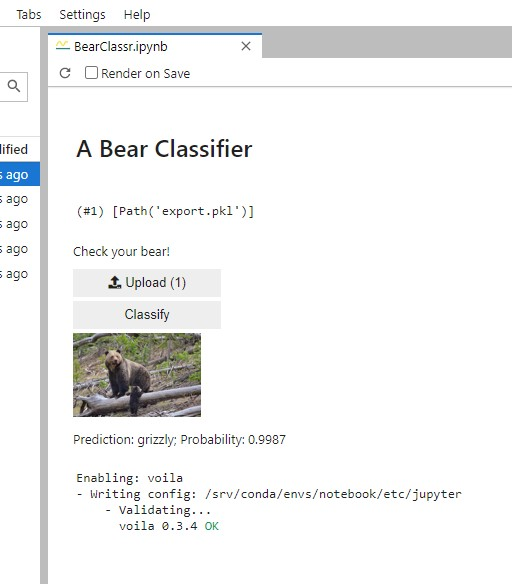

### Bear Classifier

This is an experiment/demo for understanding deployment of a very simple Jupyter-based web app rendered with Voila and served by Binder.

Here's the link which works now, but not sure how long it stays hosted:

Bear Classifier is a web service that accepts any image file upload and returns a classification as one of four types of bear, grizzly, black, teddy, or polar.

Backend is a ResNet18 CNN model trained on 378MB of labeled bear images from Bing Image Search. Accuracy of the model is not bad at 98.4% on the test set.

UX of the deployed app after Voila rendering - it works, but there's a lot of unwanted cruft and fluff. Don't know how to clean it up.

